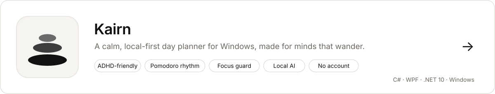

<picture>
  <source media="(prefers-color-scheme: dark)" srcset="assets/banner-dark.svg">
  
</picture>

  I make desktop tools that stay out of your way: light, private, and kind. 
  No accounts, no tracking, no cloud you didn't ask for.

## Featured

<a href="https://github.com/zakenoo/Kairn">
  <picture>
    <source media="(prefers-color-scheme: dark)" srcset="assets/kairn-dark.svg">
    
  </picture>
</a>

## How I build

- **Calm by design.** Interfaces that lower the noise instead of adding to it.
- **Local-first.** Everything runs and is stored on your PC, even the AI.
- **No guilt.** Progress you can see, never a red percentage staring back at you.
- **Light.** Small memory footprint, nothing running when it doesn't need to.

  

